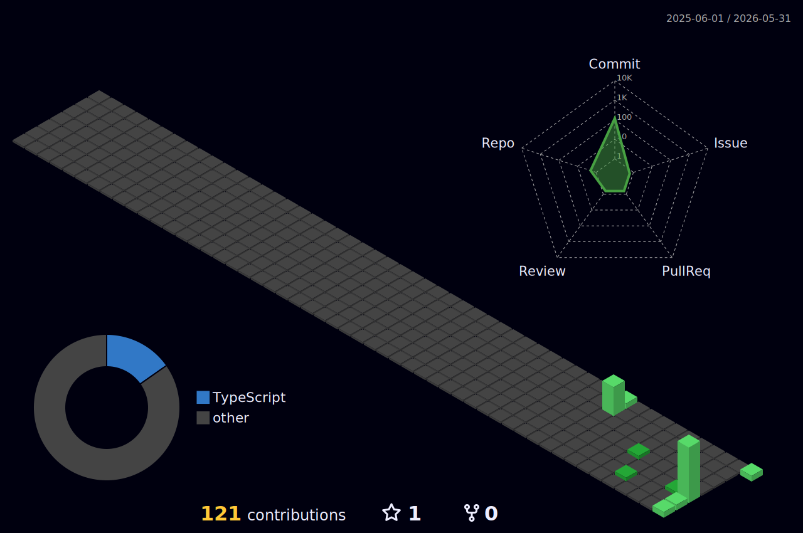

<div align="center">


[](https://github.com/tegardevINF?tab=followers)
[](https://github.com/tegardevINF?tab=stars)
[](https://github.com/tegardevINF)
<div>
<br/>


</div>

---


### Who am I?

<p>I am an <b>Autonomous Systems & Swarm Engineer</b> based in Yogyakarta. I specialize in designing backends that don't just process API endpoints, but orchestrate state machines, run background daemons, and enable AI agents to reason in isolated sandboxes.</p>

<p>I believe in system reliability, zero-trust sandboxing, and deterministic agent execution. Currently, I am designing self-healing runtimes, implementing Model Context Protocol (MCP) integrations, and building swarms of specialized agents that work together seamlessly.</p>

<br/>

- Designing **autonomous agent swarms** and background daemons
- Deep focus on **system design**, **distributed architectures**, and **concurrency**
- Building custom **Model Context Protocol (MCP)** bridges for secure system access
- Ask me about **Python**, **TypeScript**, **ChromaDB**, **Docker**, **Multi-Agent Systems**
- I believe in writing code that's easy to audit and self-heal
- Goal: Build robust agent runtimes that survive real-world chaos
- 2026: Deploy agent swarms, enforce circuit breakers, automate everything
- System status: `Active`

<br clear="right"/>

---

## Social & Contact

<div align="center">

<p>Always open to technical discussions, project collaborations, or just chatting about the latest tech.</p>

<br/>

[](https://github.com/tegardevINF)
[](https://linkedin.com/in/tegardevINF)
[](https://instagram.com/tegardevINF)
[](https://t.me/tegardevINF)
[](mailto:tegardevINF@gmail.com)
[](https://twitter.com/tegardevINF)

</div>

---

## Now Playing

<div align="center">

[](https://spotify-github-profile.kittinanx.com/api/view?uid=312mqggn5esmuj4kb2k24gcnt7iu&redirect=true)

</div>

---

## Tech Stack & Arsenal

> The tools I use to bring ideas to life.

<div align="center">

### Languages & Core

| <br/><b>Python</b> | <br/><b>JavaScript</b> | <br/><b>TypeScript</b> | <br/><b>Rust</b> | <br/><b>Go</b> | <br/><b>Bash</b> | <br/><b>C++</b> | <br/><b>Java</b> |
| :---: | :---: | :---: | :---: | :---: | :---: | :---: | :---: |

### Backend & Frameworks

| <br/><b>Node.js</b> | <br/><b>Express</b> | <br/><b>FastAPI</b> | <br/><b>Flask</b> | <br/><b>Django</b> | <br/><b>NestJS</b> | <br/><b>GraphQL</b> | <br/><b>Next.js</b> |
| :---: | :---: | :---: | :---: | :---: | :---: | :---: | :---: |

### Databases & Storage

| <br/><b>PostgreSQL</b> | <br/><b>MySQL</b> | <br/><b>MongoDB</b> | <br/><b>Redis</b> | <br/><b>Elasticsearch</b> | <br/><b>Firebase</b> | <br/><b>Cassandra</b> | <br/><b>SQLite</b> |
| :---: | :---: | :---: | :---: | :---: | :---: | :---: | :---: |

### DevOps & Cloud

| <br/><b>Docker</b> | <br/><b>K8s</b> | <br/><b>Google Cloud</b> | <br/><b>AWS</b> | <br/><b>Azure</b> | <br/><b>Jenkins</b> | <br/><b>Terraform</b> | <br/><b>NGINX</b> |
| :---: | :---: | :---: | :---: | :---: | :---: | :---: | :---: |

### Tools & Others

| <br/><b>Git</b> | <br/><b>GitHub</b> | <br/><b>GitLab</b> | <br/><b>VS Code</b> | <br/><b>Vim</b> | <br/><b>Neovim</b> | <br/><b>Postman</b> | <br/><b>Linux</b> |
| :---: | :---: | :---: | :---: | :---: | :---: | :---: | :---: |

</div>

---

## AI & Machine Learning Stack

> Orchestrating multi-agent systems and deploying containerized agent runtimes.

<div align="center">

### Core AI/ML Libraries


<br/><br/>

### LLM & Generative AI


<br/><br/>

### Frameworks & Swarm Infrastructure


<br/><br/>

### MLOps & Deployment


</div>

---

## System Architecture Philosophy


I believe that a great backend is not just about writing code that works — it's about designing systems that **survive the chaos** of real-world traffic.

**1. Scalability**
- Horizontal scaling with stateless services
- Aggressive caching with Redis
- Async processing via message queues (Kafka, RabbitMQ)
- Read replicas & smart DB indexing

**2. Reliability**
- Circuit breakers to prevent cascading failures
- Retries with exponential backoff
- Idempotency for critical operations
- Observability: logs, traces, metrics

**3. Maintainability**
- Clean Architecture — business logic != infrastructure
- SOLID principles
- Conventional Commits + linear git history
- Code reviews as learning, not gatekeeping

<br clear="right"/>

---

## Deep Dive: Swarm Orchestration


Integrating AI today is about designing systems where multiple specialized agents cooperate. This requires sandbox management, circuit breaking, and secure system communication layers.

**The Swarm Loop I Build:**
1. **Observation** — Watcher daemons monitor workspace changes and execution errors
2. **Audit** — Critic agents run AST parses and lint audits on-the-fly
3. **Mutation** — Mutator engines auto-patch syntax issues and logic anomalies
4. **Verification** — Test daemons execute validation pipelines to ensure stability

**Agentic Infrastructure Focus:**
- Model Context Protocol (MCP) integrations
- Multitier circuit breaker routing (Claude, Gemini, Groq, Ollama)
- Byte-by-byte token swarm scrubbing for reasoning streams
- Isolated workspace sandboxing and tenant isolation

<br clear="left"/>

---

## Veltrix V2 — Engineering Specifications

### 1. Multi-Tier Inference & Failover Routing

Inference workflows route through a structured fallback chain to maximize service availability:

```text
Anthropic Claude -> OpenAI GPT-4o -> Google Gemini -> Groq Cloud -> OpenRouter -> Local Ollama
```

- **Active Circuit Breaker**: On `429` or `5xx`, the provider is blacklisted for 60s. Active streams skip the blacklisted provider immediately.
- **Proactive Active Probing**: Background daemon issues lightweight `OPTIONS` checks periodically to track latency via EMA.
- **Speculative Context Seeding**: During failover, Veltrix seeds target providers with a compressed semantic digest to minimize context loss.

### 2. Isolated Semantic Context & Vector RAG

Absolute tenant isolation with optimized memory footprint:

- **Dynamic Workspace Namespacing**: Embedding indices compile to isolated namespaces scoped by session boundaries (`user_{user_id}_documents`).
- **Selective Retrieval Gating**: Inlet processors classify user prompts in real-time. Conversational inputs bypass ChromaDB entirely.
- **Local Embedding Execution**: Ingestion queue routes documents to Celery background workers via local Xenova/ONNX transformers to 384-dimensional vectors.

### 3. ASGI Middleware Stream Scrubbing

Preventing cognitive reasoning leaks in main user chat windows:

- **Token Swarm Scrubber**: Real-time regex engines process token chunks byte-by-byte. Text within `<think>` and `</think>` boundaries pipes into metadata channels.
- **Speculative Prompt Prefilling**: Static prompt fragments are cached and directed to providers supporting pre-filled KV caches, cutting latency by up to 40%.

### 4. Layered Memory Lifecycle

Preventing VRAM exhaustion and context truncation with tiered retention:

| Tier | Type | Description |
|------|------|-------------|
| Short-Term | Text Buffers | Last 3 dialogue iterations for high-fidelity context |
| Mid-Term | Async Summaries | Compiled during system idle loops |
| Long-Term | Vector Index | ChromaDB entities indexed for cross-session semantic search |

---

## GitHub Analytics

<div align="center">

<a href="https://github.com/tegardevINF">
  
  
</a>

<br/><br/>


<br/><br/>


</div>

---

## GitHub Metrics

<div align="center">


</div>

---

## 3D Contribution Graph

<div align="center">

<picture>
  <source media="(prefers-color-scheme: dark)" srcset="profile-3d-contrib/profile-night-green.svg" />
  <source media="(prefers-color-scheme: light)" srcset="profile-3d-contrib/profile-season-animate.svg" />
  
</picture>

</div>

---

## Profile Summary Cards

<div align="center">


<br/><br/>


&nbsp;


<br/>


&nbsp;


</div>

---

## Development Workflow


### The Terminal is My Home

- **Shell**: `zsh` + `Oh My Zsh` + `Powerlevel10k`
- **Multiplexer**: `tmux` — code left, server right, logs bottom
- **Editor**: `Neovim` (LazyVim) for speed, VS Code for debugging

### Git Hygiene

- **Commits**: Conventional Commits (`feat:`, `fix:`, `docs:`)
- **Branching**: Short-lived feature branches, `main` always deployable
- **History**: Rebase over merge — keep it linear

### API Design

- **Contract First**: OpenAPI/Swagger YAML before writing code
- **Versioning**: `/api/v1/` in URL — always
- **Security**: OAuth2 + JWT + rate limiting by default

<br clear="right"/>

---

## Weekly Language Stats

<div align="center">

```text
TypeScript       ████████████████████░░   85.34 %
Python           ████████████░░░░░░░░░░   50.12 %
Rust             ████░░░░░░░░░░░░░░░░░░   15.20 %
YAML / Docker    ███░░░░░░░░░░░░░░░░░░░   12.45 %
Bash             ██░░░░░░░░░░░░░░░░░░░░    8.10 %
Other            █░░░░░░░░░░░░░░░░░░░░░    3.30 %
```

</div>

---

## Deployment Strategy


### CI/CD Pipeline

1. **Push** — feature branch
2. **Test** — Unit + Integration via GitHub Actions
3. **Build** — Docker image tagged with commit SHA
4. **Push** — Container registry (GHCR / Docker Hub)
5. **Deploy** — Kubernetes rolling update — zero downtime

### Blue-Green vs Canary

- **Blue-Green** — Critical updates, instant full rollback ready
- **Canary** — New features to 5% users first, monitor, then rollout

<br clear="left"/>

---

## Security Best Practices

<div align="center">

| Area | Practice |
|------|----------|
| Passwords | `bcrypt` / `Argon2` — never plain text |
| Auth | JWT short expiry + refresh token rotation |
| Access | RBAC — least privilege always |
| Data | Encrypted at rest + TLS 1.3 in transit |
| Inputs | Sanitize all inputs — prevent SQLi & XSS |
| Secrets | AWS Secrets Manager / HashiCorp Vault — no hardcoding |

</div>

---

## Recommended Resources

<div align="center">

### Books That Changed How I Think

| Book | Author | Why |
|------|--------|-----|
| Designing Data-Intensive Applications | Martin Kleppmann | The Bible of Backend |
| Clean Architecture | Robert C. Martin | Write code that lasts |
| Building Microservices | Sam Newman | System design bible |
| The Pragmatic Programmer | Hunt & Thomas | Developer mindset |
| Release It! | Michael T. Nygard | Production readiness |

### Courses Worth Your Time

- **CS50** — Harvard's legendary intro to CS
- **AWS Solutions Architect** — Cloud fundamentals
- **FastAPI + Python** — testdriven.io
- **LangChain for LLM Apps** — DeepLearning.AI
- **System Design Interview** — ByteByteGo

</div>

---

## Contributing to Open Source

<div align="center">

<p>Strong believer in Open Source. Want to contribute to any of my projects?</p>

```bash
# 1. Fork the repo
# 2. Create your feature branch
git checkout -b feature/AmazingFeature

# 3. Commit your changes
git commit -m 'feat: Add some AmazingFeature'

# 4. Push to the branch
git push origin feature/AmazingFeature

# 5. Open a Pull Request
```

</div>

---

## Dev Quote

<div align="center">

[](https://github.com/piyushsuthar/github-readme-quotes)

</div>

---

## Dev Humor

<div align="center">


</div>

---

## Support My Work

<div align="center">

<p>If you find my projects helpful, consider buying me a coffee!</p>

<a href="https://www.buymeacoffee.com/tegardevINF">
  
</a>

</div>

---

<div align="center">

### Let's Build Something Extraordinary

<br/>

<b>Thanks for scrolling all the way down. Got a crazy idea? Hit me up.</b>

<br/><br/>


<br/>


</div>
